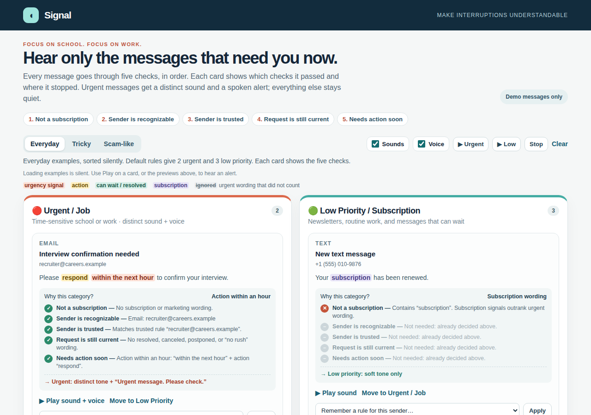
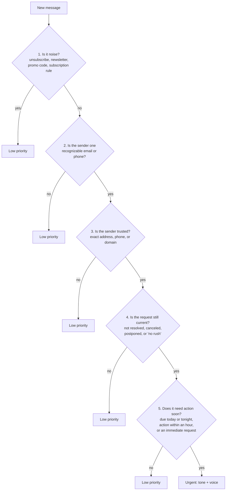

# Signal — Voice Alerts for Messages That Actually Matter

Signal is a browser prototype that decides which emails and texts are worth interrupting you for. Urgent school or work messages play a distinct tone and say *"Urgent message. Please check."* Everything else gets a soft sound or nothing.

**Live demo:** https://signal-alert-voice.dxliang.chatgpt.site



## The problem

Students and early-career professionals get a steady stream of newsletters, promotions, and group updates. Mixed in are a few messages that need action now: a shift to cover in 20 minutes, an assignment due tonight, a recruiter waiting for confirmation. Most notification systems treat these the same way, so people either miss the important ones or learn to ignore alerts entirely.

The hard part is not playing a sound. It is deciding **what counts as useful and urgent**, and doing it in a way the user can inspect and correct.

## How a message is analyzed

I broke "is this worth interrupting me?" into five questions, checked in order. The first rule that applies decides the result. In the demo, every card shows all five checks (passed, stopped, or skipped) and highlights the phrases that decided it: urgency signals, action verbs, "can wait" wording, subscription wording, and urgent wording that was ignored because the sender was not trusted.



In short: **urgent = trusted sender × still current × action needed soon, and not a subscription.** (A user-defined "always urgent" contact acts as an override at step 3 and skips steps 4–5; a subscription rule still overrides it.)

Some design decisions behind the rules:

| Decision | Why | Example case |
|---|---|---|
| Subscription signals beat trust | A newsletter from your school is still a newsletter. | `trusted-newsletter` |
| Urgent wording cannot create trust | "URGENT: verify your account" from a stranger is the classic scam pattern. | `unknown-urgent`, `unknown-password` |
| Exact sender matching only | `campus-example.com` and `mail.campus.example` should not inherit trust from `campus.example`. | `lookalike-domain`, `untrusted-subdomain` |
| The real mailbox beats the display name | `"Professor Lee" <random@other.example>` is not the professor. | `trusted-name-untrusted-address` |
| "Resolved" and "no rush" apply only to their own sentence | "The outage is resolved. Please join the call in 10 minutes." is still urgent. | `resolved-then-action` |
| Time alone is not enough | "The meeting lasts one hour" has a time but no request. | `routine-duration`, `plain-near-time` |
| Quoted history is ignored | An old "ASAP" in a reply thread is not a new request. | `quoted-urgency` |

Full rule details are in [docs/how-it-works.md](docs/how-it-works.md).

## Evaluation and error analysis

[`tests/classification-cases.json`](tests/classification-cases.json) contains **78 synthetic messages** (28 urgent, 50 low priority), each with an expected category and a one-line rationale. The original 46 cases cover school and work requests, stale subjects, negation, scam-like pressure, lookalike domains, and sender-parsing edge cases. Another 32 regressions cover half-hour deadlines, called-off events, deferred replies, and negative cases such as unrelated reassurance, negated cancellation, quoted history, and separate current requests.

| Rule version | Urgent messages missed | Unnecessary urgent alerts | Cases matching expectation |
|---|---|---|---|
| Previous rules (whole-message keyword matching) | 8 | 20 | 50 / 78 |
| Clause-scoped rules before the focused phrase fixes | 5 | 11 | 62 / 78 |
| Current rules | 0 | 0 | 78 / 78 |

What the previous whole-message rules got wrong on the original 46 cases, grouped by cause:

| Failure pattern | Cases | Example | Fix |
|---|---|---|---|
| Real requests with no urgency keyword | 2 missed | "Can you cover my shift in 20 minutes?" | Recognize an action verb + a time window of 60 minutes or less |
| One "no rush" silenced the whole message | 1 missed | "No rush on the report, but call me now about the delivery." | Split into clauses; "no rush" applies only to its own clause |
| Stale context still triggered voice | 5 false alarms | Subject "URGENT outage", body "The outage is resolved." | Resolved / canceled / extended in the body overrides an old subject; ignore `>` quoted lines |
| Trust leaked through the sender field | 4 false alarms | `"professor@campus.example" <fraud@unknown.example>` | Parse exactly one mailbox or phone; never match addresses inside display names or free text |

The misses came from depending on keywords. The false alarms came from ignoring context and from loose sender matching.

The demo includes a **"Check the rules against the test set"** panel that runs all 78 cases in the browser against both the current and previous rules, and shows the five-check trace for each case. Phrase regressions also assert the deciding rule, matched explanation, and trace evidence. The original 46 decisions, including their traces and highlights, are unchanged by these phrase fixes.

**Caveat:** I wrote this set and tuned the rules against it, so it is a regression suite, not an independent accuracy estimate for real inboxes.

### Stress test with generated messages

A seeded generator builds messages from labeled parts and works out the expected category from those parts, without calling the classifier:

- **Sender:** trusted (exact email, domain rule, display name + mailbox, mixed case, phone formats) or untrusted (unknown, lookalike domain, subdomain, trusted domain used as a prefix, spoofed display name, unknown phone, phone digits inside an email)
- **Request:** same-day deadline, action within an hour, immediate request, can-wait + current request, routine, not soon enough, says it can wait, stale urgent subject, urgency only in quoted history
- **Extras:** optional subscription noise and quoted history

Expected category: urgent only if the sender is trusted, there is no subscription noise, and the request is time-sensitive.

| Mode | What it tests | Result (10 seeds × 300 messages) |
|---|---|---|
| Known phrasing | Whether the rules combine correctly: precedence, sender parsing, sentence-level context | 3,000 / 3,000 match |
| + Natural phrasing | Everyday wording the rules were not written for (labels are human judgment) | Failures appear, all from natural phrasing |

Known phrasing uses the same vocabulary the rules were written for, so a perfect score shows the logic is consistent, not that it understands language. The natural-phrasing failures are the more useful output. They show exactly which wording the rules miss:

| Missed or misread | Example |
|---|---|
| Deadline without "due" / "submit by" | "Please submit the timesheet by tonight." |
| Time in other units | "in 15 mins", "in 1 hour" |
| Pressure without a keyword | "This can't wait. Please call me back." |
| Updates in other words (stale subject wins) | "The system issue has been sorted out." |
| Negated attendance request | "The planning call is in 30 minutes, but you don't need to join." |

The rules now recognize "in half an hour", "has been called off", and "don't worry about replying right away" (including typographic apostrophes). These scenarios have moved into the generator's known-phrasing set so they stay covered.

The demo's **"Stress-test with generated messages"** panel runs this in the browser. Set the count and seed (the same seed always gives the same messages), turn natural phrasing on or off, and open any failure to see its five-check trace. **"Send one random message to the inbox"** delivers a generated message as if it just arrived, plays its alert, and shows whether the classifier matched the generator's expected category.

## Known limitations

- **Useful is not the same as urgent.** With two buckets, "interview scheduled for next Tuesday" or "assignment due tomorrow" lands in Low Priority next to newsletters. These are exactly the messages students most want to keep.
- Sorting uses phrase matching, not semantic understanding. Complex negation, absolute dates ("due Oct 3"), and unfamiliar phrasing can be misclassified.
- **Priority is not a safety verdict.** The demo cannot authenticate senders; a spoofed exact trusted address still matches.
- No live inbox or SMS is connected. Messages are entered manually or loaded from examples.

## Next steps

1. **Value × urgency instead of a single urgent flag.** High value + time-sensitive → voice alert; high value + not time-sensitive → normal notification or daily digest; low value → quiet.
2. **Close the gaps the generator found**, adding each natural phrasing to the known set once the rules handle it, so it stays covered.
3. **Evaluate on real mail.** Label 100–200 of my own (anonymized) messages by hand, run the classifier, and publish an error analysis of what it misses and why.
4. **Gmail mobile pilot.** A consent-based, read-only Gmail pilot for Android and iPhone that tests the alert on an actual locked phone. The design, including OAuth, deduplication, and privacy gates, is in [docs/gmail-mobile-pilot-design.md](docs/gmail-mobile-pilot-design.md). The mobile pilot is separate work in progress and is not included in this browser release.

## Features

- Opens with sorted examples: everyday, tricky edge cases, and scam-like messages
- Five-check decision trace and phrase highlighting on every card
- In-page benchmark comparing current and previous rules
- Seeded message generator with expected labels, for stress tests and simulated incoming mail
- Two columns: **Urgent / Job** and **Low Priority / Subscription**
- Trusted contacts by exact email, domain, or phone number, saved in the browser
- Per-card one-time moves and saved sender rules; changing a rule re-sorts the inbox silently
- Sequential audio queue so one urgent announcement is not cut off by the next message

## Run it

The app is a single static file with no build step. Open `dist/index.html` in a browser.

Tests (Node.js 22+):

```sh
node --test --experimental-test-isolation=none tests/classification.test.cjs tests/prototype.test.cjs
```

The tests cover classification, the five-check trace, the in-page benchmark, the message generator (3,000 known-phrasing messages must all match), sender-rule persistence, and alert sequencing with mocked browser audio APIs. They do not verify audible output from speakers.

## Tech

HTML, CSS, vanilla JavaScript, Web Audio API, Web Speech API, `node:test`. Built with the help of AI coding assistants; I defined the classification rules and test cases and reviewed every change.
